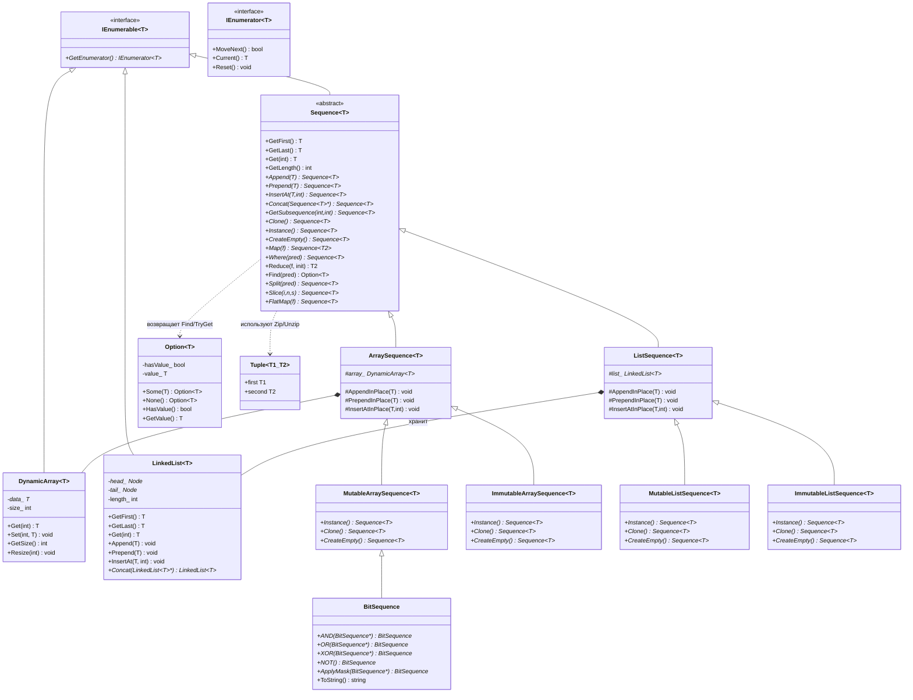
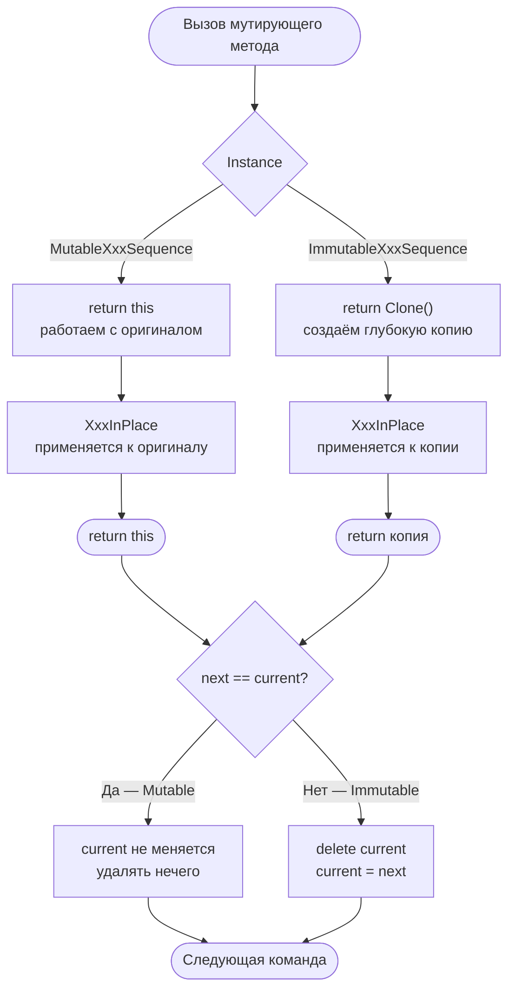
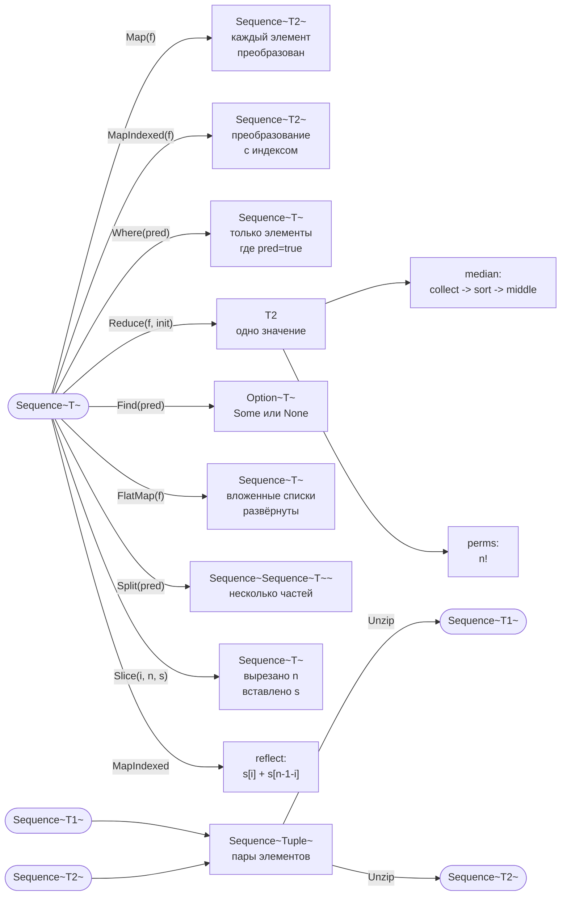
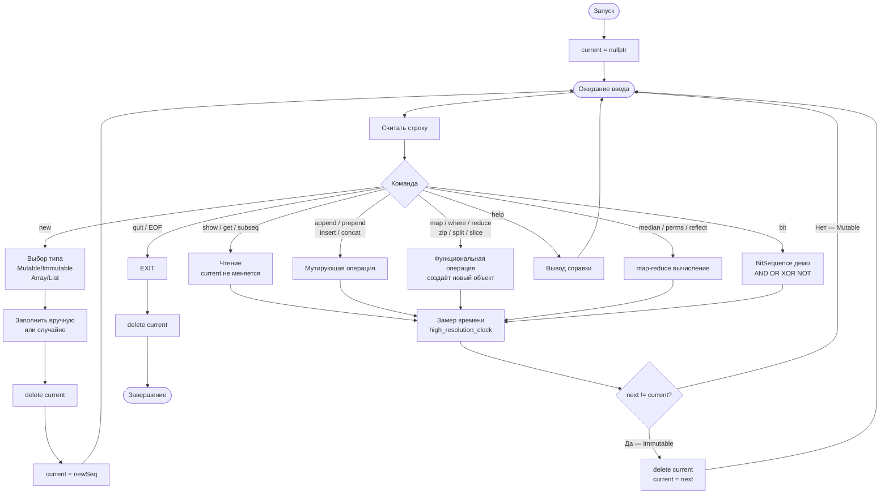

## Структура
Проект построен по принципу **разделения ответственностей (Separation of Conserns)**. Каждый модуль решает ровно одну задачу. Взаимодействие между слоями происходит исключительно через публичные интерфейсы.

## Слой хранения данных
### DynamicArray\<T\>
Реализует **динамический массив** — структуру данных с непрерывным размещением элементов в памяти. Элемент с индексом `i` находится по адресу `base_ptr + i * sizeof(T)`, что дает доступ за O(1).

Операция `Resize` выполняет **реаллокацию**: выделяет новый блок размером `newSize`, копирует `min(oldSize, newSize)` элементов, освобождает старый блок. Сложность — O(n). Следствие: вставка в произвольную позицию требует сдвига всех последующих элементов — тоже O(n).

Класс реализует **правило трех (Rule of Three)**: определены копирующий конструктор, оператор присваивания и деструктор. Это гарантирует корректную семантику владения: каждый экземпляр владеет собственным блоком памяти, копирование всегда глубокое (deep copy).

### LinkedList\<T\>
Реализует **односвязный список** — структуру данных с дискретным размещением элементов в куче. Каждый узел (`Node`) хранит значение и указатель на следующий узел. Элементы физически не связаны в памяти, что исключает кэш-локальность.

Доступ по индексу — O(n): требует обхода с головы. Вставка в начало и конец — O(1): перенаправление одного указателя без аллокации дополнительного блока. Хранение `tail_` — оптимизация, устраняющая линейный проход при `Append`.

Деструктор выполняет **линейный обход** с удалением каждого узла. Критичен порядок операций: `next` сохраняется до `delete`, иначе — обращение к освобожденной памяти (undefined behaviour).

## Абстрактный класс Sequence\<T\>

`Sequence<T>` — **абстрактный базовый класс (ABC)**. Все публичные методы объявлены чисто виртуальными (`= 0`), что делает прямое инстанцирование невозможным. Класс определяет контракт: любой подкласс обязан реализовать полный набор операций.

Наследование от `IEnumerable<T>` добавляет в контракт метод `GetEnumerator()` — фабричный метод для получения итератора.

### Паттерн Mutable / Immutable через виртуальный Instance()
Центральная архитектурная идея проекта — реализация двух семантик владения через единственный виртуальный метод:
```cpp
virtual Sequence<T>* Instance() = 0;
```
Все мутирующие методы (`Append`, `Prepend`, `InsertAt`, `Concat`) следуют единому шаблону:
```
1. Вызвать Instance() — получить целевой объект для модификации
2. Выполнить мутацию на целевом объекте
3. Вернуть целевой объект
```
Поведение определяется переопределением `Instance()` в конкретном подклассе:
- **MutableXxx::Instance()** -> `return this` — мутация выполняется **in-place**, метод возвращает тот же объект. Семантика изменяемого значения.
- **ImmutableXxx::Instance()** -> `return this->Clone()` — перед мутацией создается полная копия объекта, мутация выполняется над копией, оригинал остается нетронутым. Семантика персистентной (неизменяемой) структуры данных.

### Разрыв циклической зависимости
`Sequence<T>` содержит методы (`Map`, `Where` и т.д.), которые создают объекты типа `MutableArraySequence<T>`. `MutableArraySequence<T>` наследует от `Sequence<T>`. Возникает циклическая зависимость заголовочных файлов.

Решение — **отложенное включение**:
1. Опережающее объявление `template <class T> class MutableArraySequence` в начале `Sequence.h` — компилятор узнает о существовании типа.
2. Методы `Map`, `Where` и т.д. **объявляются** в теле класса, но не определяются.
3. В конце `Sequence.h`, после полного определения класса `Sequence<T>`, включается `ArraySequence.h`.
4. `#pragma once` предотвращает повторное включение `Sequence.h` из `ArraySequence.h`.
5. После включения `ArraySequence.h` определения методов `Map`, `Where` и т.д. становятся возможными — `MutableArraySequence` уже полностью известен.

## Функциональные операции
Методы реализуют стандартные операции функционального программирования над коллекциями. Все они — **чистые трансформации**: читают из `this`, создают новый объект, не изменяют источник.
| Операция | Тип | Сложность |
| :-- | :-- | :-- |
| `Map(f)` | `(T -> T2) -> Sequence<T2>` | O(n) |
| `Where(p)` | `(T -> bool) -> Sequence<T>` | O(n) |
| `Reduce(f, init)` | `((T2,T) -> T2, T2) -> T2` | O(n) |
| `MapIndexed(f)` | `((T,int) -> T2) -> Sequence<T2>` | O(n) |
| `FlatMap(f)` | `(T -> Sequence<T>) -> Sequence<T>` | O(n*m) |
| `Find(p)` | `(T -> bool) -> Option<T>` | O(n) |
| `Split(p)` | `(T -> bool) -> Sequence<Sequence<T>*>` | O(n) |
| `Slice(i, n, s)` | `(int, int, Sequence<T>?) -> Sequence<T>` | O(n) |
| `Zip(a, b)` | `(Sequence<T1>, Sequence<T2>) -> Sequence<Tuple<T1,T2>>` | O(min(n,m)) |
| `Unzip(s)` | `Sequence<Tuple<T1,T2>> -> (Sequence<T1>, Sequence<T2>)` | O(n) |

## Вспомогательные типы
### Option\<T\>
Реализует **тип-сумму** с двумя состояниями: `Some(value)` и `None`. Эквивалент `std::optional<T>` из C++17, реализованный вручную.

Метод `GetValue()` бросает исключение при вызове на `None` — fail-fast поведение. Вызывающий код обязан проверить `HasValue()` заранее, иначе получит явную ошибку, а не тихое неопределенное поведение.

### Итераторы (IEnumerator / IEnumerable)
Реализация **паттерна Iterator** в стиле .NET/Java: итератор — отдельный объект, создаваемый фабричным методом `GetEnumerator()`. Итератор создается на куче (`new`), владение передается вызывающему коду.

Начальное состояние итератора — **перед** первым элементом. Протокол обхода:
```
while (enumerator->MoveNext())
    process(enumerator->Current());
```
`begin()`/`end()` — дополнительный слой, адаптирующий этот интерфейс к **range-based for** из C++11. Для `DynamicArray` это просто сырые указатели, для `LinkedList` — обертка над указателем на узел.

### BitSequence
Наследует `MutableArraySequence<Bit>`, добавляя **побитовые операции**. Тип `Bit` хранит `int`, гарантируя значение 0 или 1 через маску `v & 1` в конструкторе. Конструктор и оператор преобразования помечены `explicit` — запрет неявных преобразований между `int` и `Bit`.

## Управление памятью в UI
UI хранит единственный указатель `current` на активную последовательность. После каждой мутирующей операции возникает **вилка владения**:
```cpp
SeqInt* next = current->Append(v);
if (next != current) { delete current; current = next; }
```
- `next == current` -> Mutable: объект изменен на месте, владелец не меняется, `delete` не нужен.
- `next != current` -> Immutable: создан новый объект, старый более не нужен, выполняется `delete`, `current` переназначается.

Без этой проверки Immutable-последовательности порождали бы **утечку памяти** при каждой операции: старый объект терял последний указатель на себя без освобождения.

# Диаграммы

## Иерархия классов


## Паттерн `Mutable / Immutable`


## Поток функциональных операций


## Жизненный цикл в UI

